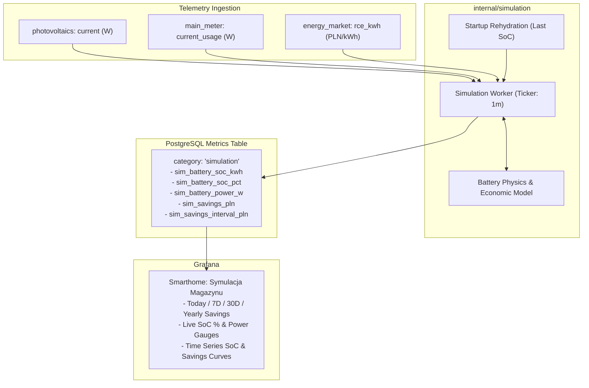

# Energy Storage Simulation Subsystem Design Specification

## 1. Overview
The Energy Storage Simulation subsystem provides real-time hypothetical modeling of a residential battery energy storage system (BESS) installed alongside existing photovoltaics (8.2 kW installed) and home electrical loads (including a heat pump).

The simulation computes battery state-of-charge (SoC), energy flows, and theoretical financial earnings/savings (daily, weekly, monthly, and yearly) compared against a baseline scenario without a battery. Results are recorded into PostgreSQL under `category = 'simulation'` and visualized in a dedicated Grafana dashboard.

---

## 2. System Architecture & Components



### 2.1 Component Responsibilities

1. **`internal/simulation/model.go`**:
   * Models the battery physical state:
     * `CapacityKWh`: Total energy capacity (default: 10.0 kWh).
     * `MaxPowerKW`: Maximum charge/discharge power (default: 5.0 kW).
     * `Efficiency`: One-way charge and discharge efficiency (default: 0.95, giving ~90.25% round-trip).
     * `CurrentEnergyKWh`: Stored energy in kWh ($0 \le \text{CurrentEnergyKWh} \le \text{CapacityKWh}$).
   * Evaluates each discrete time step $\Delta t$ given:
     * House load power $P_{\text{load}}$ (W)
     * PV generation power $P_{\text{pv}}$ (W)
     * PSE dynamic price $RCE$ (PLN/kWh)
     * Grid distribution fee per kWh (default: 0.40 PLN/kWh)
   * Dispatches power according to the Smart Hybrid strategy:
     * **Surplus PV ($P_{\text{pv}} > P_{\text{load}}$)**: Charges battery up to inverter limit; remaining PV is exported at $RCE$.
     * **Deficit ($P_{\text{load}} > P_{\text{pv}}$)**: Discharges battery up to inverter limit to cover load; avoids grid import cost $(RCE + \text{fee})$.
     * **Grid Price Arbitrage**:
       * If battery $< 80\%$ and $RCE < 0.15$ PLN/kWh (or negative): charge from grid at $(RCE + \text{fee})$.
       * If battery $> 50\%$ and $RCE > 0.85$ PLN/kWh during peak hours: discharge to grid at $RCE$ after covering load.
   * Computes financial delta:
     $$\Delta \text{Savings} = \text{Simulated Cashflow} - \text{Baseline Cashflow}$$

2. **`internal/simulation/worker.go`**:
   * Runs as a background goroutine started in `cmd/server/main.go`.
   * On startup, rehydrates the last known battery energy from `metrics` (or defaults to 50% capacity if no prior records exist).
   * On each interval tick (default: 1 minute):
     * Queries the latest $P_{\text{pv}}$, $P_{\text{load}}$, and $RCE$ from the database.
     * Advances the model by elapsed time $\Delta t$.
     * Persists calculated metrics via `MetricStore.InsertMetric(...)`.
   * Gracefully shuts down on `context.Context` cancellation.

3. **`internal/config/config.go` Updates**:
   * `SimulationEnabled` (`SIMULATION_ENABLED`, bool, default `true`)
   * `SimulationInterval` (`SIMULATION_INTERVAL`, duration, default `1m`)
   * `SimulationBatteryCapacityKWh` (`SIMULATION_BATTERY_CAPACITY_KWH`, float64, default `10.0`)
   * `SimulationBatteryPowerKW` (`SIMULATION_BATTERY_POWER_KW`, float64, default `5.0`)
   * `SimulationDistributionFee` (`SIMULATION_DISTRIBUTION_FEE`, float64, default `0.40`)

4. **`dashboards/smarthome-symulacja.json`**:
   * Pre-configured Grafana dashboard auto-loaded via git-sync.
   * Displays financial cards and charts across Daily, Weekly, Monthly, and Projected Yearly timeframes.

---

## 3. Financial Calculation Model

### 3.1 Baseline Scenario (Without Battery)
For each interval $\Delta t$ (hours):
* Net power: $P_{\text{net}} = P_{\text{pv}} - P_{\text{load}}$ (W)
* If $P_{\text{net}} \ge 0$ (Surplus):
  $$\text{Export (kWh)} = \frac{P_{\text{net}} \times \Delta t}{1000}$$
  $$\text{Baseline Revenue (PLN)} = \text{Export} \times RCE$$
  $$\text{Baseline Cost (PLN)} = 0$$
* If $P_{\text{net}} < 0$ (Deficit):
  $$\text{Import (kWh)} = \frac{|P_{\text{net}}| \times \Delta t}{1000}$$
  $$\text{Baseline Cost (PLN)} = \text{Import} \times (RCE + \text{DistributionFee})$$
  $$\text{Baseline Revenue (PLN)} = 0$$
* $\text{Baseline Cashflow} = \text{Baseline Revenue} - \text{Baseline Cost}$

### 3.2 Simulated Scenario (With Battery)
* Battery charge or discharge power $P_{\text{batt}}$ (W) is applied (+ = charging, - = discharging).
* Net grid power: $P_{\text{grid}} = P_{\text{pv}} - P_{\text{load}} - P_{\text{batt}}$
* If $P_{\text{grid}} \ge 0$:
  $$\text{Simulated Export (kWh)} = \frac{P_{\text{grid}} \times \Delta t}{1000}$$
  $$\text{Simulated Revenue (PLN)} = \text{Simulated Export} \times RCE$$
  $$\text{Simulated Cost (PLN)} = 0$$
* If $P_{\text{grid}} < 0$:
  $$\text{Simulated Import (kWh)} = \frac{|P_{\text{grid}}| \times \Delta t}{1000}$$
  $$\text{Simulated Cost (PLN)} = \text{Simulated Import} \times (RCE + \text{DistributionFee})$$
  $$\text{Simulated Revenue (PLN)} = 0$$
* $\text{Simulated Cashflow} = \text{Simulated Revenue} - \text{Simulated Cost}$

### 3.3 Net Theoretical Savings
$$\Delta \text{Savings (PLN)} = \text{Simulated Cashflow} - \text{Baseline Cashflow}$$
This interval savings is recorded as `sim_savings_interval_pln`.

---

## 4. Database Schema & Metrics

All simulated telemetry is written into the existing PostgreSQL `metrics` table with `category = 'simulation'`:

| Metric Name | Unit | Description |
|---|---|---|
| `sim_battery_soc_kwh` | kWh | Current stored energy in battery |
| `sim_battery_soc_pct` | % | Current State of Charge percentage (0–100%) |
| `sim_battery_power_w` | W | Current power flow (+ charging, - discharging) |
| `sim_savings_interval_pln` | PLN | Incremental savings generated in the last interval |
| `sim_savings_pln` | PLN | Cumulative running savings since simulation inception |

---

## 5. Grafana Dashboard Design

File: `dashboards/smarthome-symulacja.json`

### 5.1 Panels
1. **Stat Cards Row (y=0, h=5)**:
   * **Today's Savings (PLN)**:
     ```sql
     SELECT COALESCE(SUM(value), 0) AS "Oszczędności Dziś"
     FROM metrics
     WHERE category = 'simulation' AND metric_name = 'sim_savings_interval_pln'
       AND "timestamp" >= DATE_TRUNC('day', NOW());
     ```
   * **Last 7 Days Savings (PLN)**:
     ```sql
     SELECT COALESCE(SUM(value), 0) AS "Oszczędności 7 Dni"
     FROM metrics
     WHERE category = 'simulation' AND metric_name = 'sim_savings_interval_pln'
       AND "timestamp" >= NOW() - INTERVAL '7 days';
     ```
   * **Last 30 Days Savings (PLN)**:
     ```sql
     SELECT COALESCE(SUM(value), 0) AS "Oszczędności 30 Dni"
     FROM metrics
     WHERE category = 'simulation' AND metric_name = 'sim_savings_interval_pln'
       AND "timestamp" >= NOW() - INTERVAL '30 days';
     ```
   * **Projected Yearly Savings (PLN)**:
     ```sql
     SELECT COALESCE(
       (SUM(value) / NULLIF(EXTRACT(EPOCH FROM (MAX("timestamp") - MIN("timestamp"))), 0) * 86400 * 365.25),
       0
     ) AS "Prognoza Roczna"
     FROM metrics
     WHERE category = 'simulation' AND metric_name = 'sim_savings_interval_pln';
     ```

2. **Live Battery Gauges Row (y=5, h=6)**:
   * **Simulated Battery SoC (%)**: Gauge panel (0–100%) with thresholds (Red <20%, Yellow 20–50%, Green >50%).
   * **Battery Power (W)**: Stat panel showing current charge (+W) or discharge (-W) rate.

3. **Charts Row (y=11, h=10)**:
   * **Battery State of Charge & Power Time Series**: Plots `sim_battery_soc_kwh` and `sim_battery_power_w` over the selected Grafana time window.
   * **Cumulative Savings Over Time**: Plots cumulative sum of `sim_savings_interval_pln` over time.

---

## 6. Error Handling & Edge Cases
1. **Missing Telemetry**:
   If either $P_{\text{pv}}$, $P_{\text{load}}$, or $RCE$ cannot be retrieved, the worker logs a warning, skips the step without updating battery energy, and retries on the next tick.
2. **Database Reconnect / Restarts**:
   On startup, the worker reads the latest `sim_battery_soc_kwh` from PostgreSQL so battery charge is preserved across service restarts.
3. **Invalid Inverter or Telemetry Values**:
   Battery energy is strictly bounded: $0 \le \text{CurrentEnergyKWh} \le \text{CapacityKWh}$. Values are sanitized against `NaN` or infinite numbers.

---

## 7. Testing Plan
1. **Unit Tests (`internal/simulation/model_test.go`)**:
   * Solar surplus charging behavior up to inverter and capacity limits.
   * Deficit discharge behavior down to 0 kWh.
   * Efficiency loss calculation (round-trip energy dissipation).
   * Arbitrage triggers (low RCE grid charge, high RCE grid discharge).
   * Baseline vs Simulated financial math accuracy.
2. **Worker Tests (`internal/simulation/worker_test.go`)**:
   * MockStore integration verifying periodic ticks, metric recording, and context cancellation.
   * Rehydration logic test on worker boot.
3. **Config Tests (`internal/config/config_test.go`)**:
   * Validation of default values and environment variable overrides.
